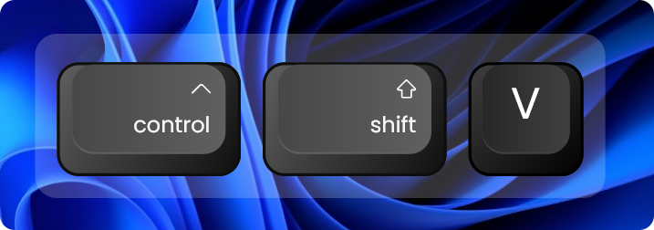
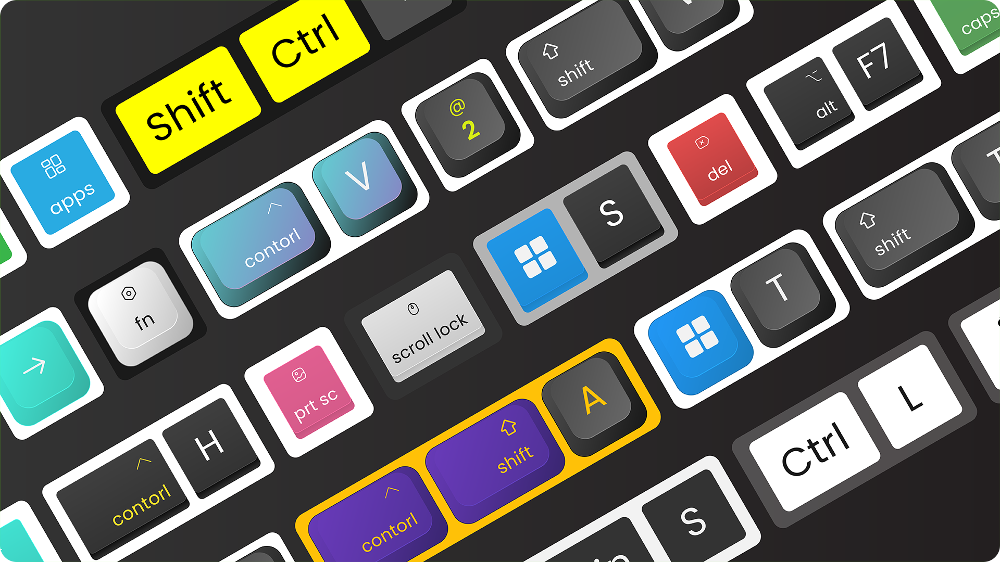
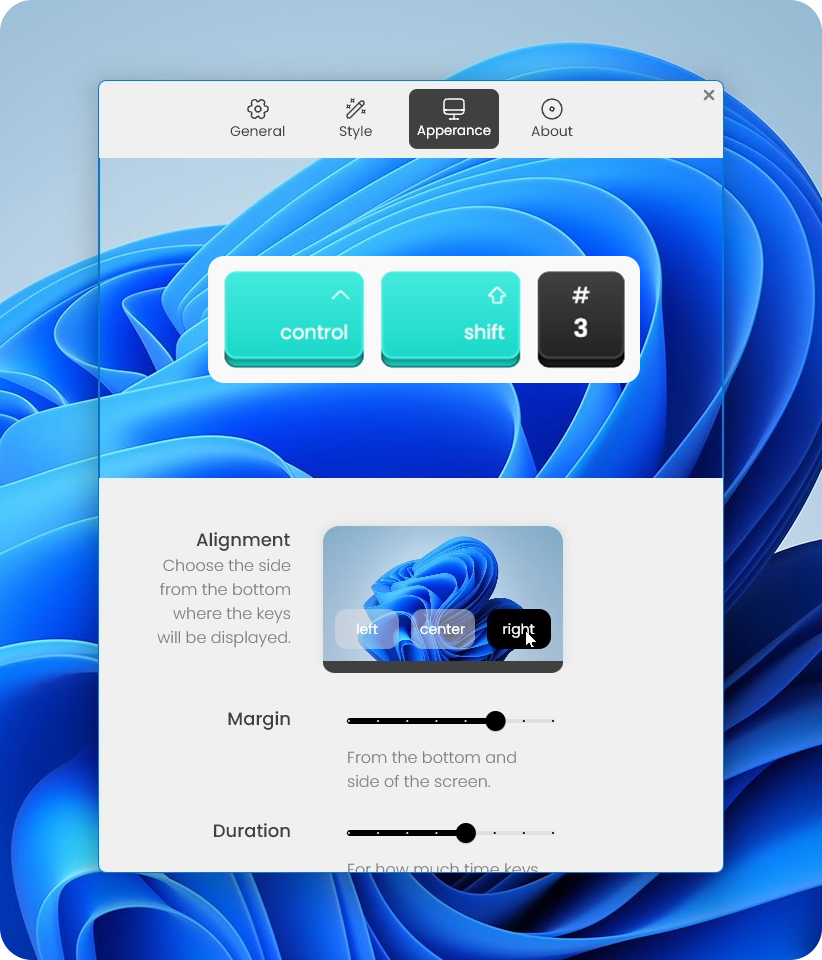

# [Keyviz](https://mularahul.github.io/keyviz.html)

Keyviz is a free and open-source software to visualize your ⌨️ keystrokes in realtime!

Let your audience know what handy shortcuts/keys you're pressing during screencasts, presentations, collaborations, or whenever you need it.

## 🦄 Style

Don't restrain yourself to just black & white! Change the visualization's style, size, color (modifier and normal keys), border, icon, and symbols.

## ⚙️ Fully Customizable

Powerful and easy to use configuration options. 
- Filter normal keys and only display shortcuts like <kbd>Ctrl</kbd> + <kbd>S</kbd>
- Adjust visualization position on the screen
- Decide from how much the visualization lingers on the screen before animating out
- Switch between animation presets to animate your visualization in & out

# Installation
You can download the installer from the [Github Releases](#installation) and start to visualize your keystrokes in realtime.

# Quickstart
Watch the below videos to get started with Keyviz.
- [Promotional video](#)
- Basic Setup

# Feature Requests
If you want to request any features, join our [discord](https://discord.gg/qyrKWCvtEq) community and let us know about your suggestions. You can also vote for the requested features by others and see the future development plans.