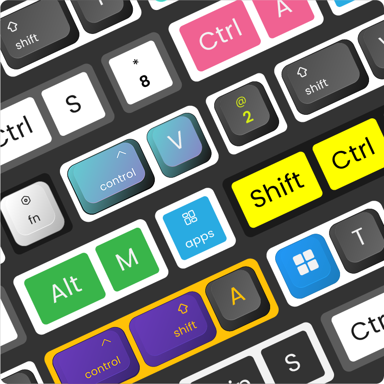

# Keyviz

Keyviz is a free and open-source software to visualize your ⌨️ keystrokes in realtime! Let your audience know what handy shortcuts/keys you're pressing during screencasts, presentations, collaborations, or whenever you need it.

## 🦄 Style

Don't restrain yourself to just black & white! Change the visualization's style, size, color (modifier and normal keys), border, icon, and symbols.

## ⚙️ Fully Customizable

Powerful and easy to use configuration options. 
- Filter normal keys and only display shortcuts like <kbd>Ctrl</kbd> + <kbd>S</kbd>
- Adjust visualization position on the screen
- Decide for how much the visualization lingers on the screen before animating out
- Switch between animation presets to animate your visualization in & out

# Installation
You can download the latest version of keyviz from the [Github Releases](https://github.com/mulaRahul/keyviz/releases) page. Unzip the downloaded file, run the installer and follow the familiar steps to install keyviz.

# Quickstart
You can check out this [video tutorial](https://youtu.be/FwuTqWzlRSc) as well.

To get started, follow the above [installation](#installation) process. You can start visualizing your keystrokes by just running the application.

To open the settings window, find the keyviz icon on the right side of the **Taskbar** or **Taskbar > Hidden Icons <kbd>^</kbd>**. Then click on the icon and select **Settings**. The settings window will appear from which, you customize the style, appearance, and other general settings of the visualization.

# Feature Requests
If you want to request any features, join our [discord](https://discord.gg/qyrKWCvtEq) community and let us know about your suggestions. You can also vote for the requested features by others and see the future development plans.
